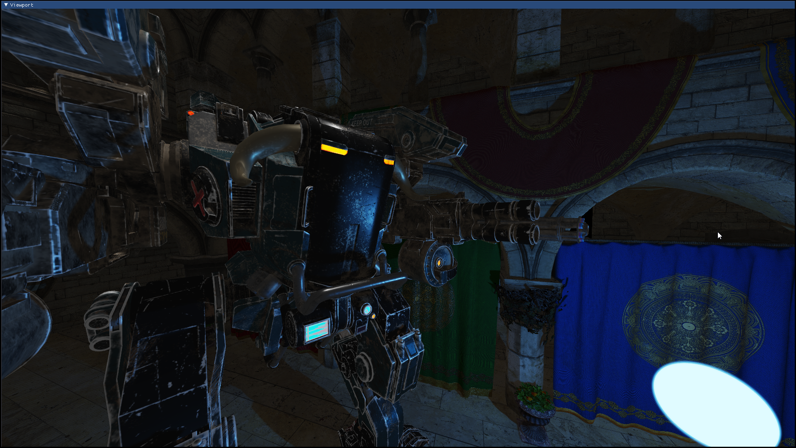
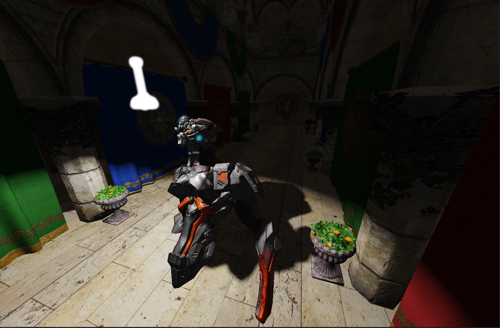
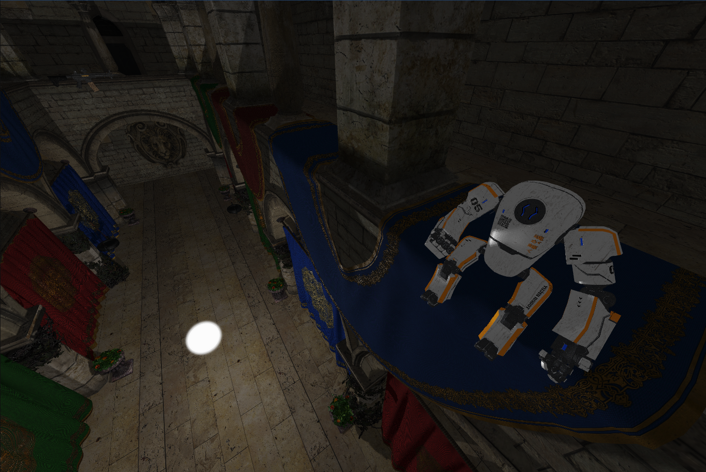
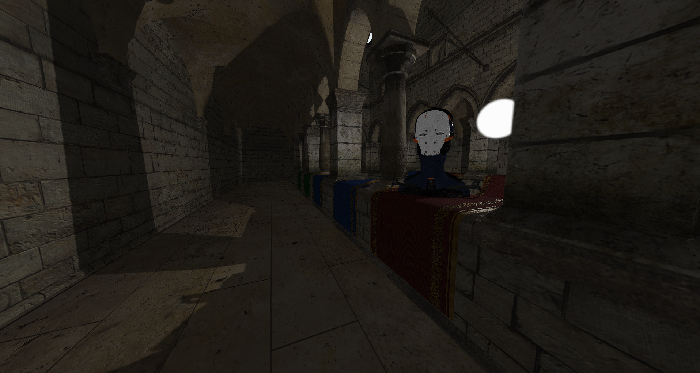
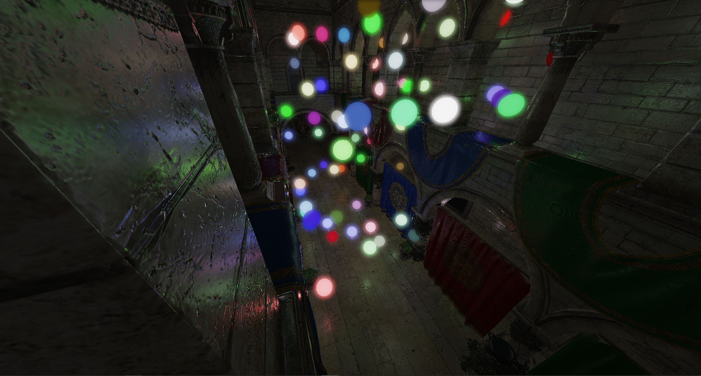
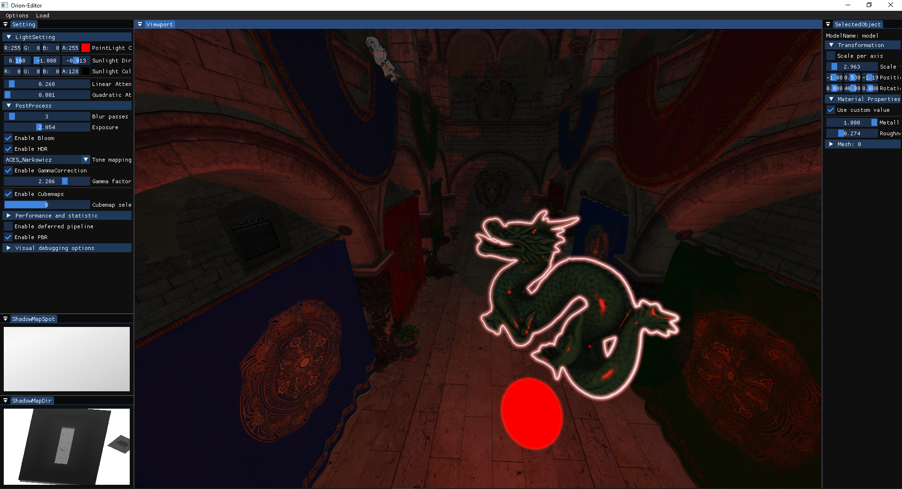

# Orion Engine

*Orion primarily focuses on the graphics aspect of game development.*

## About

Orion is a real-time game engine that supports both 2D and 3D development. 
The goal of this project is to create AAA-like graphics with good FPS. Here, I am implementing all rendering techniques that are often used by game developers and other interesting features.

## Technologies

Some of the features that are already included in Orion:

- Orion supports a range of advanced rendering techniques, such as:
  - PBR workflow using the Cook-Torrance model
  - The post-processing stage includes techniques such as Bloom, HDR, various tonemappers (ranging from basic ones like Reinhard to filmic ones like ACES), dithering, and gamma correction.
  - Deferred rendering and forward rendering
  - Shadow mapping with PCF
  - Three different light casters (spot, directional, point)
  - Different AA techniques (currently only MSAA and FXAA are available)
  - SSAO (screen-space ambient occlusion)
  - Multiple viewports and cameras support

- Different optimization routines:
  - 2D and 3D batching by material
  - Frustum culling and face culling

- Other features:
  - 2D animation system (3D animation will be available in the future)
  - Mouse picking with model outlining and ability to adjust selected model as desired (transform and material properties)

## Dependencies
  - glm: for mathematics operations and transformations
  - GLFW and glad: for window creation and OpenGL context initialization
  - stb_image: for image loading and texture mapping
  - spdlog: for logging and debugging purposes
  - ImGui: for creating graphical user interfaces (GUIs) and debugging tools
  - assimp: for importing 3D models and their associated materials and textures
  
## How to use it
- Clone the project from GitHub recursively to include all submodules: git clone --recursive https://github.com/Mordentary/Orion
- Run Premake to generate the project files for your platform: premake5 <action> (where <action> is the name of the platform-specific action, such as vs2019 for Visual Studio 2019 or gmake2 for GNU Make).
- Open the generated project files in your IDE or build system of choice and build the project.
- Once the project has been built, you can use it.
  
## Showcase
### Renderer output

### Interface

