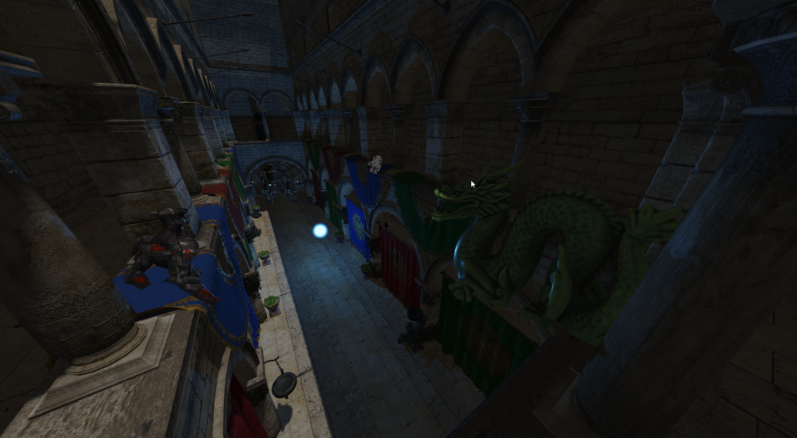
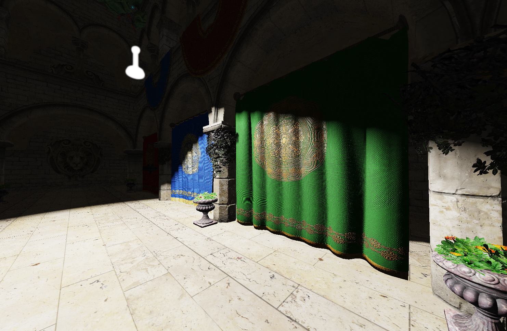

# Orion Engine

*Orion primarily focuses on the graphics aspect of game development.*

## About

Orion is a game engine that supports both 2D and 3D development. 
The goal of this project is to create AAA-like graphics with good FPS. Here, I am implementing all rendering techniques that are often used by game developers and other interesting features.

## Technologies

Some of the features that are already included in Orion:

- Orion supports a range of advanced rendering techniques, such as:
  - PBR workflow using the Cook-Torrance model
  - The post-processing stage includes techniques such as Bloom, HDR, various tonemappers (ranging from basic ones like Reinhard to filmic ones like ACES), dithering, and gamma correction.
  - Deferred rendering and forward rendering
  - Shadow mapping with PCF
  - Three different light casters (spot, directional, point)
  - Different AA techniques (currently only MSAA and FXAA are available)
  - SSAO (screen-space ambient occlusion)
  - Multiple viewports and cameras support

- Different optimization routines:
  - 2D and 3D batching by material
  - Frustum culling and face culling

- Other features:
  - 2D animation system (3D animation will be available in the future)
  - Mouse picking with model outlining and ability to adjust selected model as desired (transform and material properties)
  
## Showcase

Interface

